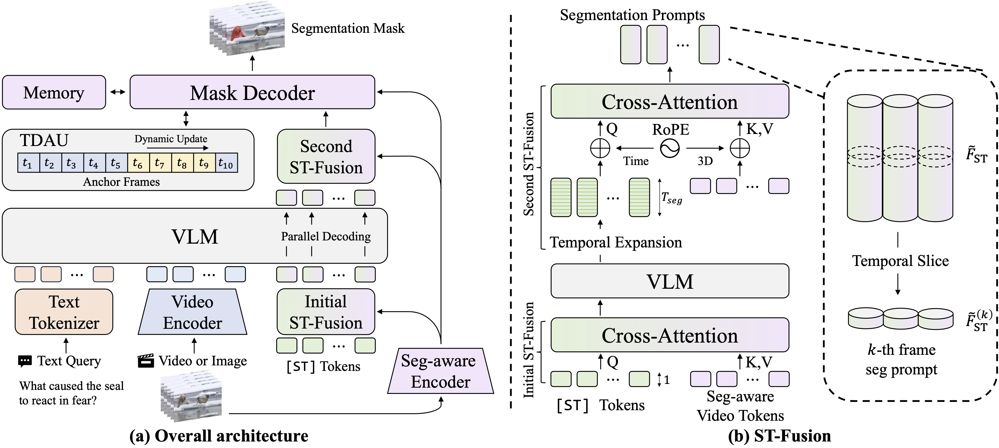

<h1 align="center">VIRST: Video-Instructed Reasoning Assistant for SpatioTemporal Segmentation</h1>
<h3 align="center">CVPR 2026</h3>

  

  Official implementation of <strong>VIRST</strong>, a video-instructed reasoning framework for spatiotemporal segmentation.

  
  
  

## TODO

- [x] release model code
- [x] release checkpoint
- [x] release data code
- [x] release utility scripts
- [ ] release eval script
- [ ] release training scripts
- [ ] demo script

## Overview

This repository contains the core training and evaluation code for VIRST, including:

- model definition in `model/`
- training entrypoints in `train.py` and `train_stage3.py`
- RVOS evaluation in `eval.py`
- dataset handling in `data/`
- utility code in `utils/`

## Checkpoint

Pretrained checkpoint: [Google Drive](https://drive.google.com/file/d/19PrTMWWzGHBTrZ0JTe1feH205vjHkoNx/view?usp=sharing)

## Notes

- The project page will be updated as the release is polished further.

## Acknowledgements

This project builds upon prior work, including 
[VISA](https://github.com/cilinyan/VISA), 
[LISA](https://github.com/JIA-Lab-research/LISA), 
[VideoChat-Flash](https://github.com/OpenGVLab/VideoChat-Flash), 
and [SAM2](https://github.com/facebookresearch/sam2).

We thank the authors for releasing their code and models.